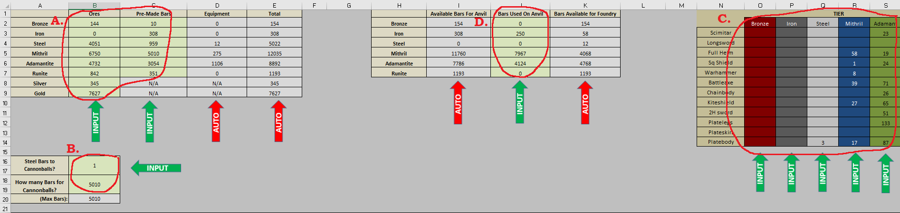
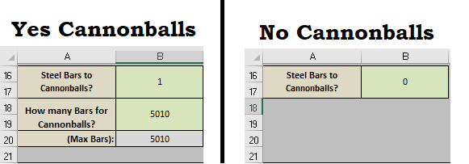
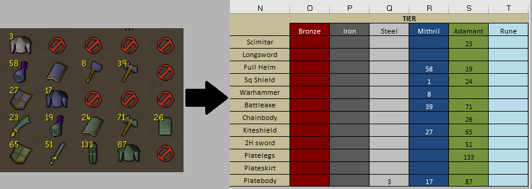
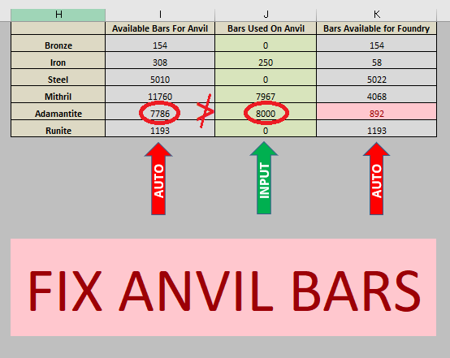
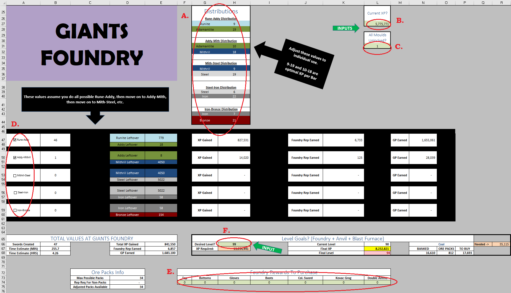
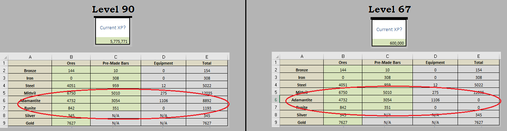
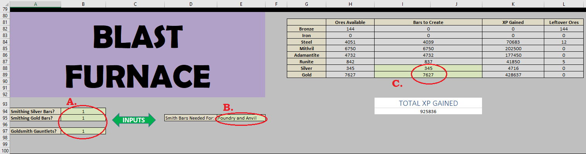
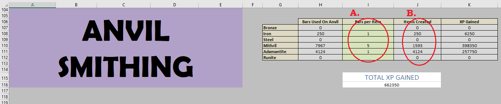
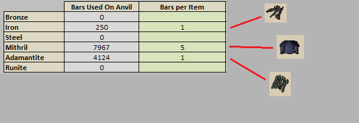

# OSRS_Smithing_Calc

## Purpose: 
The uploaded Excel spreadsheet contains a calculator intended for use in creating a plan for training the Smithing skill in Old School Runescape using the 3 primary methods of Giant's Foundry, Blast Furnace, and Anvil smithing, based on currently banked resources. As of the date of creation (03/10/23) there is no readily accessible plug-in or calculator which accounts for all 3 primary methods of training the skill simultaneously.

## Intended Use
Note that the program should be set up for immediate use with no instructions, with plenty of included notes on where to input values. That said, this section will walk through necessary input cells and provide visualizations of the instructions and the information to be gained from this program. While there are several customizations available and some are color-coded differently, the key concept to keep in mind is any cell with the light-green color scheme is a key-value which is meant to be adjusted to your individual needs.

### Section 1: Resource Input
In the first section (rows 1-21) you will input the resources you have currently banked and decide how you will allocate bars between Giant's Foundry and producing equipment.

**A.** In cells B2:C9 enter the amount of ores+bars you wish to use on your smithing grind. Note C8 and C9 will have no effect on any additional smithing XP.

**B.** In cell B16 mark '1' if any amount of steel bars will be turned into cannonballs, or '0' if no cannonballs will be made. If you marked '1', then use B18 to indicate the amount of bars to be used this way.

**C.** In cells O3:T14 enter the amount of pre-made equipment you plan to use in Giant's Foundry.

**D.** In cells J2:J7 enter the amount of bars to be used on an Anvil. Note this number should be no larger than the corresponding adjacent value in I2:I7.

### Section 2: Giant's Foundry
In the next section (rows 25-76) you will adjust values specific to the Giant's Foundry minigame.

**A.** In cells H27:H44 adjust values to match the alloys which will be created. See: https://oldschool.runescape.wiki/w/Giants%27_Foundry/Strategies#Alloys for more information.

**B.** In cell L27 enter your current XP. This will automatically adjust which metals are available for your current use (i.e. turn your Runite available to 0 if you're below lvl85)

**C.** In cell L31 indicate if you have unlocked all moulds (similar to the cannonball indicator in B16). Note this increases all outputs by roughly 1.5x from the minigame.

**D.** In cells A47:A59 indicate which alloys you intend to use in the minigame by checking/unchecking the boxes.

**E.** In cells F74:L74 indicate any rewards you intend to purchase using Foundry Reputation. Otherwise all points are assumed to be used for Ore Packs.

**F.** In cell H66 enter your goal level.

#### Important Outputs
Note that if you only desire the information found in cells A66:E68 then you may want to use the calculator at https://osrsportal.com/giants-foundry.

Note that cell R66 shows the amount of coal which would be needed to produce all the bars set aside for Foundry and Anvil smithing if these bars were smelted at the Blast Furnace (i.e. at half coal)

Note that the information in J66:R68 utilizes information from sections 3 and 4 to provide a more comprehensive look into the grind.

### Section 3: Blast Furnace
In the next section (rows 80-100) you will adjust values specific to Blast Furnace. Note if you plan to use a regular furnace the XP values will be identical, you will just need 2x the coal value in cell R66.

**A.** In cells B94:B97 mark whether Silver and/or Gold ores will be used at Blast Furnace. Additionally mark whether Goldsmith Gauntlets will be used.

**B.** In cell E95 indicate whether **all** ores will be smelted, or only ores used in Foundry or for producing equipment.

**C.** In cells I88:I89 mark the amount of Silver and/or Gold bars to be created, if applicable.

No further inputs are needed. The value in cell I94 is automatically adjusted in the "Final XP" amount in Section 2.

### Section 4: Anvil Smithing
In the final section you will see information regarding the bars that were set aside in cells J2:J7 for producing equipment at an Anvil.

**A.** The only inputs in this section are marking the type of item which will be produced. i.e. if you're making Mithril Platebodies (5 bars) but Adamant Bolts (1 bar) then you would need to put those corresponding values in column I.

**B.** The "Items Created" column can be used by the user to calculate potential profit (this calculation is left to the user as G.E. prices are constantly changing).

No further inputs are needed. The value in cell I116 is automatically adjusted in the "Final XP" amount in Section 2.

# DEV NOTES

## Advanced Use
*Note you can adjust the values in section 1 to fit hypotheticals too. Like if you know you don't want to smith all your mithril ore, you can put less than what's in your bank. Or if you're about to spend a month at MLM then you can add in hypothetical ores too.*

*Also note that you can use information from E47:E60 (leftover bars) to go back and adjust the amount of bars you'll use at an Anvil in J2:J7. That way you won't have an extra 3k mithril bars just sitting unused in the bank.*

## Potential Changes/Optimizations
*Currently I don't plan on doing much to add to this unless Jagex introduces more relevant smithing content, since I've found it works well enough. That being said, if there is interest then I can always adjust the spreadsheet in the following ways:*
*- Figure out time estimates for Blast Furnace, Anvil, and Cannonballs*
*- Figure out GP costs at Blast Furnace*
*- Figure out GP potential from alching/selling Anvil products*
*- Reorganize the inputs to make it look cleaner. I just didn't feel like unmerging all the cells and dragging all them around unless there are actually people who are interested in using this.*

## Runelite Plug-In?
*I'm not great at HTML, and I've never bothered looking into how to make a plug-in on Runelite. If you or someone you know is interested in making a more user-friendly/integrated website or plug-in version of this calculator, then by all means please utilize any material from this humble program as a baseline. I was able to use this to plan my route to 99 on my GIM, but I fully recognize that a Runelite plug-in is vastly more accessible, and more user-friendly than an Excel program.*